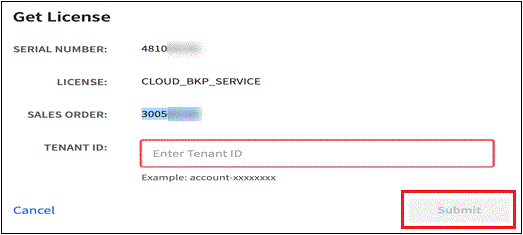

= 
:allow-uri-read: 

如果BlueXP  无法访问Internet (专用模式安装)、您应获取要上传的NetApp许可证文件。

从NetApp销售代表处购买许可证后、NetApp会向您发送一封电子邮件、其中包含序列号和其他许可详细信息。如果您无法自动看到许可证、则需要该序列号来获取相应的许可证文件。

.步骤
. 查找您的BlueXP  帐户ID：
+
.. 在BlueXP  控制台的右上角，选择image:icon-settings-option.png["BlueXP  Web控制台右上角显示的设置图标。"]>*身份和访问管理*。
.. 在"Organization"页面上、查找并复制您的帐户ID。
+
如果未列出帐户ID、而您只有一个组织ID、则需要复制该组织ID的前八个字符并将其附加到_account-_

+
例如、假设这是您的组织ID：

+
e10e1c6-80cc-4219-8e99-3c3e6b161ba5.

+
您的帐户ID如下所示：

+
account-e10e1c6

. 登录到 https://mysupport.netapp.com["NetApp 支持站点"^] 并选择*系统>软件许可证*。
. 输入许可证的序列号。
+
image:../media/screenshot_cloud_backup_license_step1.gif["按序列号搜索后显示许可证表的屏幕截图。"]

. 在*许可证密钥*列中，选择*获取NetApp许可证文件*。
. 输入您的BlueXP  帐户ID (在支持站点上称为租户ID)、然后选择*提交*以下载许可证文件。
+

